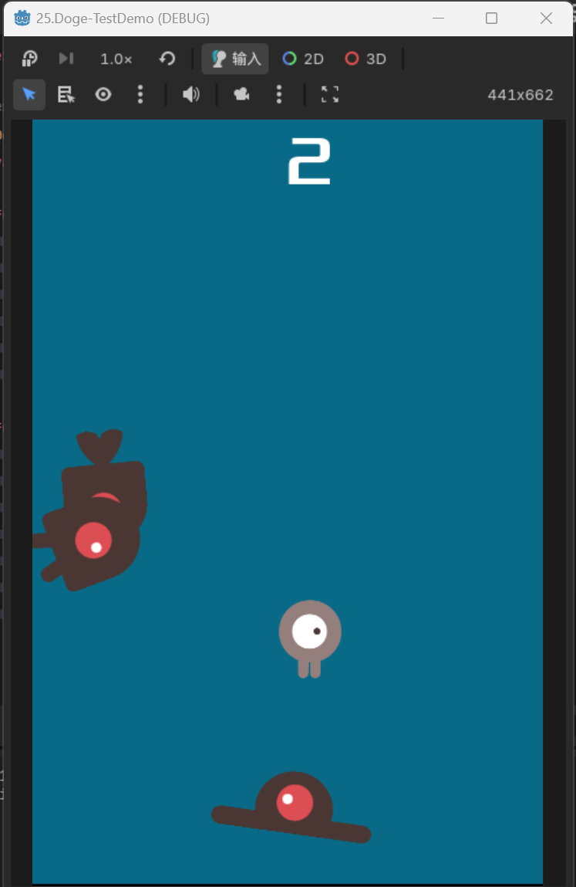

# Dodge
躲避类型的游戏  
包含 player精灵的创建、怪物的动态生成、信号的传输、碰撞检测、怪物出屏幕后的销毁处理

## 目录
#### 一. Player精灵 [详情](#一常用的-player-精灵结构)
#### 二. Mob怪物 [详情](#二mob怪物-常用结构)
#### 三. HUD界面 [详情](#三hud界面-层次结构)
#### 四. Main主界面 [详情](#四main主界面-层次结构)
-----
### 一、常用的 Player 精灵结构
> - Area2D  `(用于检测碰撞)` [挂载脚本](#代码部分绑定在area2d上)
>   - AnimatedSprite2D `(物体动画)` [详情](#物体动画)
>   - CollsionShape2D  `(自身碰撞区域)` [详情](#自身碰撞区域绘制)
>   - GPUParticles2D  `(粒子特效,用于拖影)`[详情](#粒子特效拖影)

### 物体动画
> 1. 物体动画（序列帧动画）需要设置相应的图片  
在 Sprite Frames属性中 点选 SpriteFrames后，才可以将图片拖入对应的序列帧集合中  

  

----
> 2. 在工作区最下方会出现SpriteFrames，默认集合为 default 将序列帧图片拖入该区域即可  ⭐⭐

   
`因为此项目中，player需要使用两个序列帧集合，所以default已被修改，变为 right 与 left 集合`  

----
> 3. 集合可以在  Animation 属性进行设置 , 默认集合，在 frame进行设置（根据frame的索引）  

   

### 自身碰撞区域绘制
> 1. 设置碰撞区域的形状
在 Shape属性中选择，可以根据情况选择 矩形、圆形、多边形等  

    

----
> 2. 在2d视图去，根据情况框选碰撞区域  

   

### 粒子特效：拖影   
⭐⭐⭐

> 1. 在属性面板里找到 `Texture` 属性，并将拖影图片拖入 

    

> 2. 设置粒子产生的数量`Amount` 和粒子运动的速度`Speed Scale`  

    

> 3. 需要将图层的索引`Z Index`设置到最底层，否则可能会穿模（粒子拖影显示到动画图片的前面）  

   

### 代码部分（绑定在Area2D上）

> 1. 实现精灵（人物）的四向移动  ⭐⭐⭐⭐⭐
根据人物的移动方向来设置该执行哪个序列帧动画 `AnimatedSprite2D--Frame`  

   

> 2. 根据游戏进程设置当前player的可见性
初始化时，隐藏player，游戏开始时，再显示出来，当和怪物发生碰撞时，再隐藏（同时发出被怪物击打到的**信号**）  

      

------

### 二、Mob怪物-常用结构
> - RigidBody2D  `(物理刚体)`[详情](#刚体mob) [挂载脚本](#代码部分-挂载在刚体上mob)
>   - AnimatedSprite2D `(物体动画)` [详情](#物体动画mob)
>   - CollsionShape2D  `(自身碰撞区域)` [详情](#自身碰撞区域mob)
>   - VisibleOnScreenNotifier2D  `(可见性矩形节点)`[详情](#可见性矩形mob)  

!

### 刚体Mob
> 需要将刚体的中立设置为0，否则将造成绑定该刚体的物体一直下落  

  

### 物体动画Mob  
> 同样需要设置序列帧动画集合`Sprite Frame`   

    

### 自身碰撞区域Mob  
> 设置碰撞形状
根据实际情况可调整**旋转角度**以适应player对应图像的方位  

      

### 可见性矩形Mob
> 一般用于触发信号使用，当怪物离开指定区域后隐藏  

  

### 代码部分-挂载在刚体上Mob
  

### 三、HUD界面-层次结构  
⭐
> - CanvasLayer  `(画布节点--用于渲染层级)` [挂载脚本](#代码部分-挂载在canvaslayer上-hud)
>   - Label `(文本节点--显示分数)` [详情](#文本-分数与信息显示hud)
>   - Label  `(文本节点--显示提示信息)` [详情](#文本-分数与信息显示hud)
>   - Button  `(按钮节点--开始游戏)`[详情](#按钮与时间控件-设置好连接信号-hud)  
>   - Timer  `(时间控件--用于触发延时操作)`[详情](#按钮与时间控件-设置好连接信号-hud)  

  
### 文本-分数与信息显示HUD
> 设置好位置与字体即可  

    

### 按钮与时间控件-设置好连接信号-HUD
    

### 代码部分-挂载在CanvasLayer上-HUD  
⭐⭐⭐

### 四、Main主界面-层次结构
> - Node2D  `(主节点-用于挂载其他节点与脚本)` [挂载脚本](#代码部分main-挂载在node2d)
>   - ColorRect  `(单色矩形--用作背景)` [详情](#单色矩形-背景颜色main)
>   - Scence-Player  `(实例化后的Player场景)` [详情](#player场景main)
>   - Timer  `(时间空间-怪物)`[详情](#时间控件main)
>   - Timer  `(时间空间-分数)`[详情](#时间控件main)
>   - Timer  `(时间空间-开始)`[详情](#时间控件main)
>   - Marker2D  `(位置标记节点-用于设置player出生点)`[详情](#位置标记节点main)
>   - Path2D  `(路径节点-怪物出生点)`[详情](#路径节点main)
>       - PathFollow2D `(路径点取样器-路径步进progress)`[详情](#路径节点main)
>   - Scence-HUD  `(实例化后的HUD场景)` [详情](#实例化hud场景main)
>   - AudioStreamPlayer2D  `(音乐播放器-背景音乐)`[详情](#音乐播放控件main)
>   - AudioStreamPlayer2D  `(音乐播放器-死亡音效)`[详情](#音乐播放控件main)

### 单色矩形-背景颜色Main
> 设置背景颜色与长宽  

  

### Player场景Main
> 设置图层优先级为最高，让player始终在所有图层的顶部 
在这里设置为 10   

  

> 将player挂载脚本中定义的hit信号（player与怪物碰撞时发出）
body_entered信号触发后会隐藏player节点并发出 hit 信号  

  

### 时间控件Main
> 1. 怪物出现时间控件MobTimer
设置 怪物出生 延时  

  

> 2. 分数增加时间控件ScoreTimer
无需设置  

  

> 3. 游戏开始时间控件StartTimer
设置 游戏开始延时、自动重启 

 

### 位置标记节点Main
> 定义player出生位置

 

#### 路径节点Main
> 1. Path2D设置路径途径点位  

 

> 2. PathFollow2D点取样器，用于显示在path2d路径上 某个点的**向量坐标**

 

### 实例化HUD场景Main
> 将HUD挂载的代码中的 start_game信号 连接到 Main的脚本中

 

### 音乐播放控件Main
> 将音乐文件拖入stream中

 

### 代码部分Main-挂载在Node2D
> 1. 定义怪物场景（导出模式）
需要手动拖入该变量  

 

> 2. 游戏开始、游戏结束
执行大量操作

 

> 3. 怪物生成逻辑、更新分数、开始timer倒计时
怪物生成逻辑⭐⭐⭐⭐

 