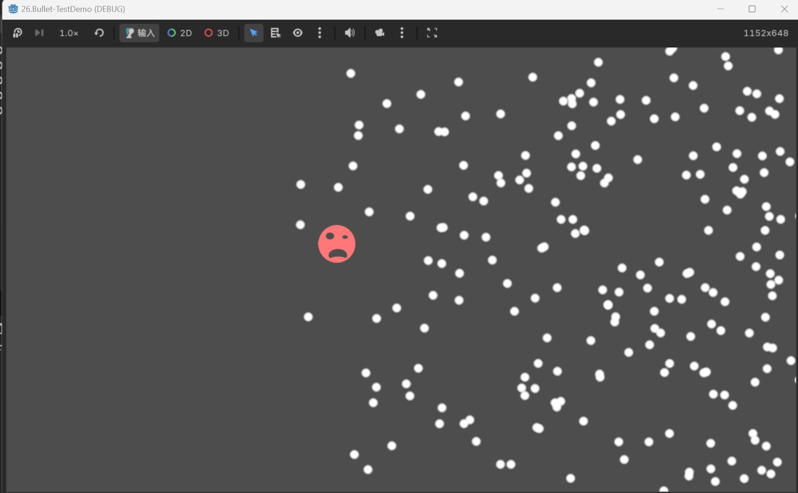
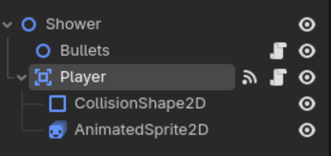
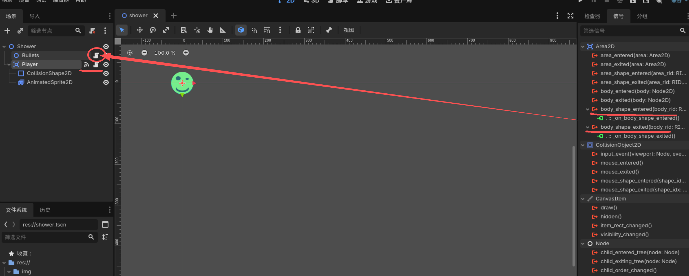
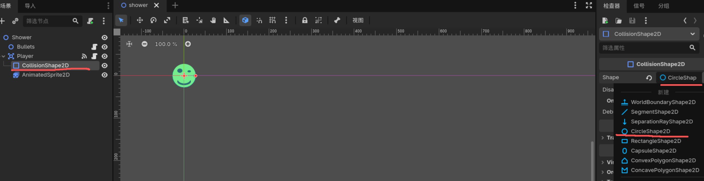
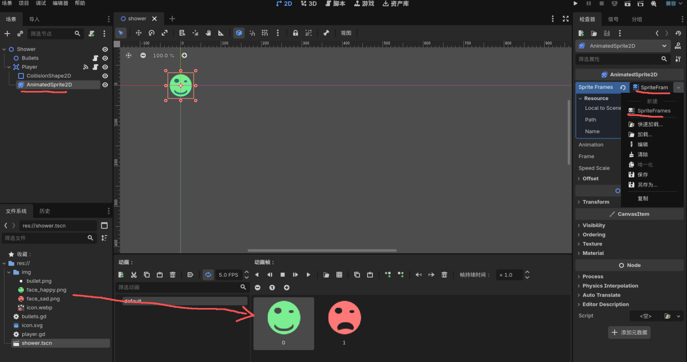

# Bullet
动态生成粒子特效（批量）

### 项目总体结构
> - Node2D  `(主节点-用于挂载其他节点)`  
>   - Node2D `(脚本挂载节点-用于动态生成粒子)` [详情](#物体动画)
>   - Area2D  `(Player自身碰撞区域)` [详情](#自身碰撞区域绘制)
>   - GPUParticles2D  `(粒子特效,用于拖影)`[详情](#粒子特效拖影)

#### 一、Player节点
> 1. Area2D 节点用于挂载脚本与进行自身碰撞区域监测
物体进入该碰撞区域、离开碰撞区域 信号  绑定到 自身挂载代码，进行处理

> 2. 设置碰撞区域、序列帧动画

 

> 3. 代码部分
设置鼠标模式--隐藏光标⭐⭐  
当前节点跟随鼠标位置⭐⭐  
当player不发生碰撞时显示绿色序列帧，当发生碰撞时显示红色序列帧  
&#x26a0;&#xfe0f; **注意:** 当不希望序列帧自动播放，在初始化方法 _ready() 中可不作操作，当希望序列帧自动播放时，可设置 `AnimatedSprite2D.Play()` 即可 ⭐

#### 二、Bullets节点(Node2D)-动态生成粒子
> 1. 代码中动态生成粒子⭐⭐⭐⭐⭐

> 2. 图像绘制方法-绘制在动态刚体的位置（默认刚体是不可见的）⭐⭐

