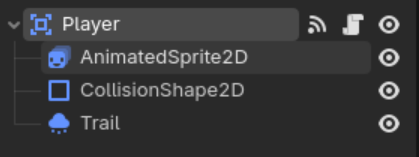
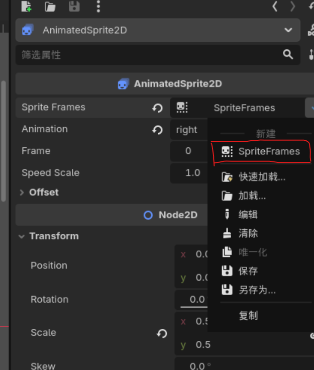
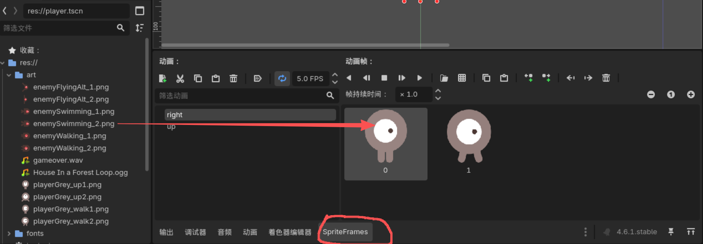

# 项目：25.Dodge
## 常用的 Player 精灵结构
> - Area2D  `(用于检测碰撞)`
>   - AnimatedSprite2D `(物体动画)` [详情](#物体动画)
>   - CollsionShape2D  `(自身碰撞区域)`
>   - GPUParticles2D  `(粒子特效)`

如下图所示：

### 物体动画
> 1. 物体动画（序列帧动画）需要设置相应的图片  
在 Sprite Frames属性中 点选 SpriteFrames后，才可以将图片拖入对应的序列帧集合中  

如下图所示：
  
> 2. 在工作区最下方会出现SpriteFrames，默认集合为 default 将序列帧图片拖入该区域即可  

如下图所示：
   
`因为此项目中，player需要使用两个序列帧集合，所以default已被修改，变为 right 与 left 集合`