# 项目：25.Dodge
## 目录
#### 一. Player精灵 [详情](#一常用的-player-精灵结构)
#### 二. Mob怪物 [详情](#二mob怪物--常用结构)
#### 三. HUD界面
-----
### 一、常用的 Player 精灵结构
> - Area2D  `(用于检测碰撞)` [挂载脚本](#代码部分绑定在area2d上)
>   - AnimatedSprite2D `(物体动画)` [详情](#物体动画)
>   - CollsionShape2D  `(自身碰撞区域)` [详情](#自身碰撞区域绘制)
>   - GPUParticles2D  `(粒子特效,用于拖影)`[详情](#粒子特效拖影)

### 物体动画
> 1. 物体动画（序列帧动画）需要设置相应的图片  
在 Sprite Frames属性中 点选 SpriteFrames后，才可以将图片拖入对应的序列帧集合中  

  

----
> 2. 在工作区最下方会出现SpriteFrames，默认集合为 default 将序列帧图片拖入该区域即可  ⭐⭐

   
`因为此项目中，player需要使用两个序列帧集合，所以default已被修改，变为 right 与 left 集合`  

----
> 3. 集合可以在  Animation 属性进行设置 , 默认集合，在 frame进行设置（根据frame的索引）  

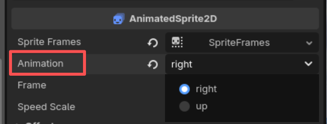   

### 自身碰撞区域绘制
> 1. 设置碰撞区域的形状
在 Shape属性中选择，可以根据情况选择 矩形、圆形、多边形等  

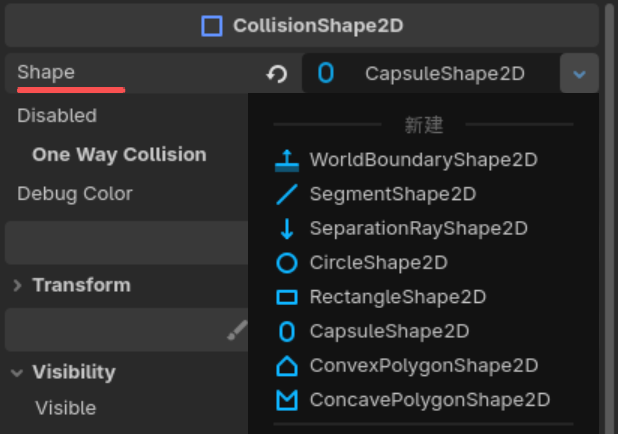    

----
> 2. 在2d视图去，根据情况框选碰撞区域  

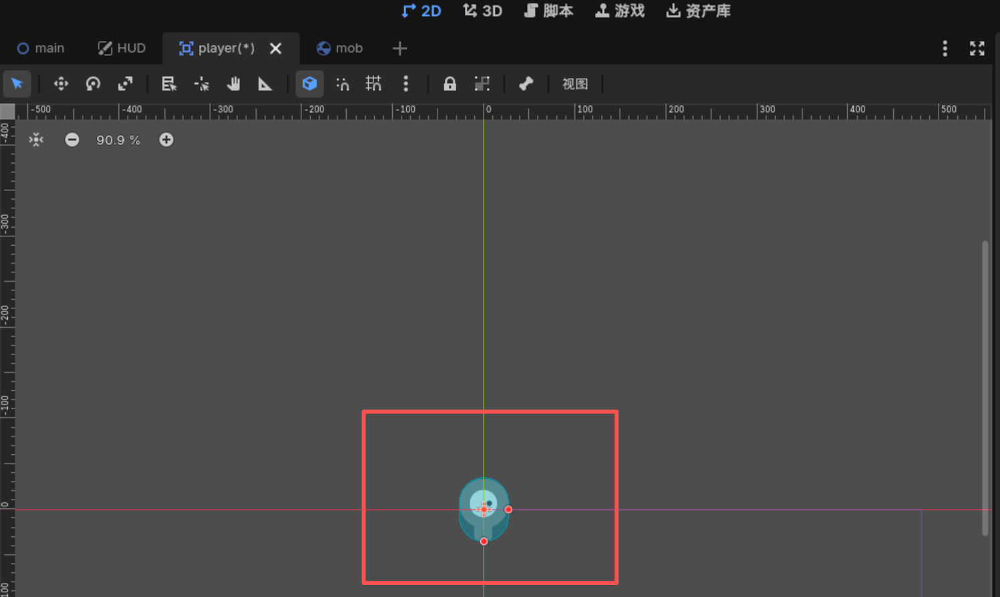   

### 粒子特效：拖影 ⭐⭐⭐

> 1. 在属性面板里找到 `Texture` 属性，并将拖影图片拖入 

    

> 2. 设置粒子产生的数量`Amount` 和粒子运动的速度`Speed Scale`  

    

> 3. 需要将图层的索引`Z Index`设置到最底层，否则可能会穿模（粒子拖影显示到动画图片的前面）  

   

### 代码部分（绑定在Area2D上）

> 1. 实现精灵（人物）的四向移动  ⭐⭐⭐⭐⭐
根据人物的移动方向来设置该执行哪个序列帧动画 `AnimatedSprite2D--Frame`  

   

> 2. 根据游戏进程设置当前player的可见性
初始化时，隐藏player，游戏开始时，再显示出来，当和怪物发生碰撞时，再隐藏（同时发出被怪物击打到的**信号**）  

      

------

### 二、Mob怪物--常用结构
> - RigidBody2D  `(物理刚体)`[详情](#刚体mob) [挂载脚本](#代码部分-挂载在刚体上mob)
>   - AnimatedSprite2D `(物体动画)` [详情](#物体动画mob)
>   - CollsionShape2D  `(自身碰撞区域)` [详情](#自身碰撞区域mob)
>   - VisibleOnScreenNotifier2D  `(可见性矩形节点)`[详情](#可见性矩形mob)  

!

### 刚体Mob
> 需要将刚体的中立设置为0，否则将造成绑定该刚体的物体一直下落  

  

### 物体动画Mob  
> 同样需要设置序列帧动画集合`Sprite Frame`   

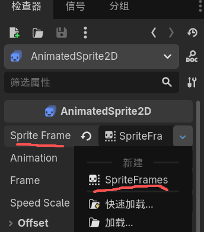  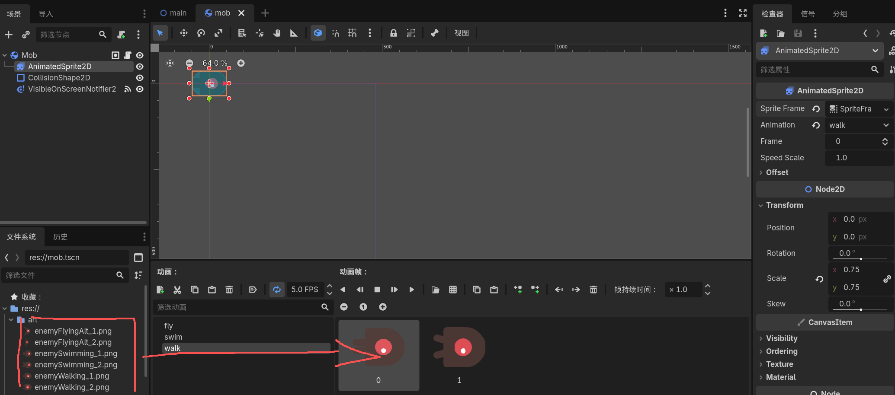  

### 自身碰撞区域Mob  
> 设置碰撞形状
根据实际情况可调整**旋转角度**以适应player对应图像的方位  

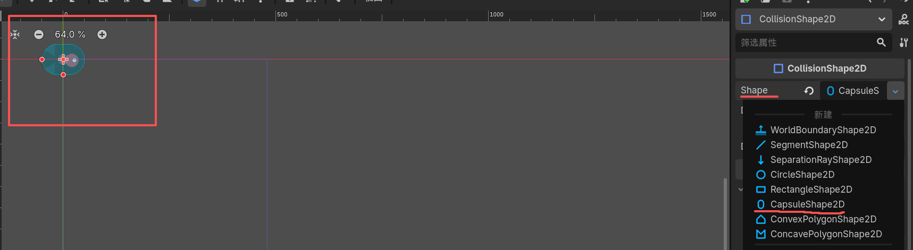  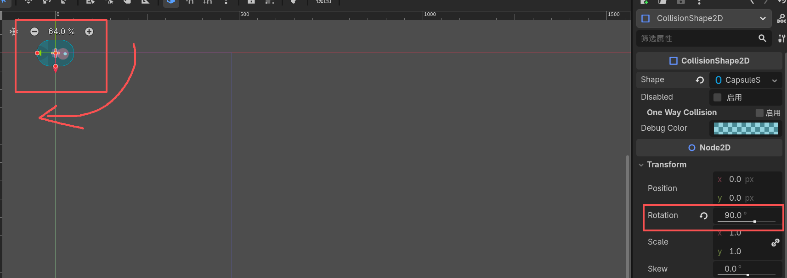    

### 可见性矩形Mob
> 一般用于触发信号使用，当怪物离开指定区域后隐藏  

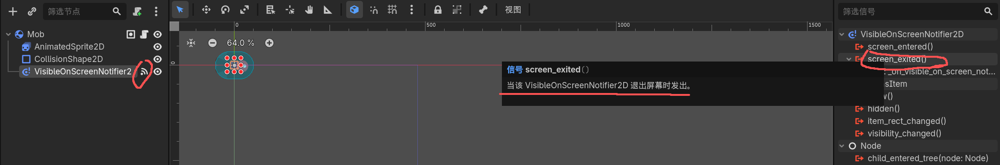  

### 代码部分-挂载在刚体上Mob
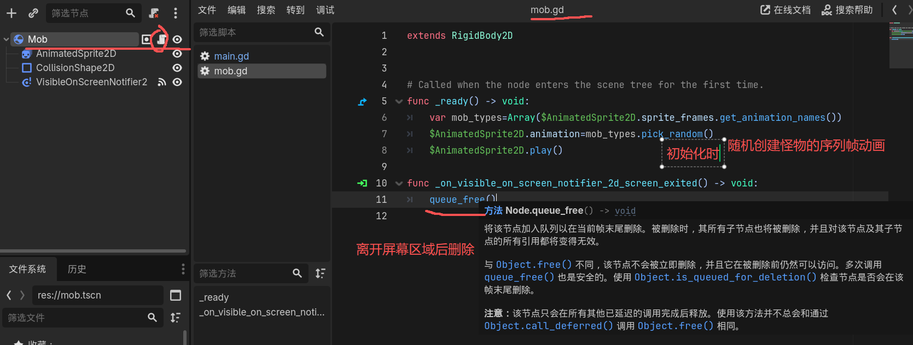  

### 三、HUD界面 - 层次结构 ⭐
> - CanvasLayer  `(画布节点--用于渲染层级)` [挂载脚本](#代码部分-挂载在canvaslayer上-hud)
>   - Label `(文本节点--显示分数)` [详情](#文本-分数与信息显示hud)
>   - Label  `(文本节点--显示提示信息)` [详情](#文本-分数与信息显示hud)
>   - Button  `(按钮节点--开始游戏)`[详情](#按钮与时间控件-设置好连接信号-hud)  
>   - Timer  `(时间控件--用于触发延时操作)`[详情](#按钮与时间控件-设置好连接信号-hud)  

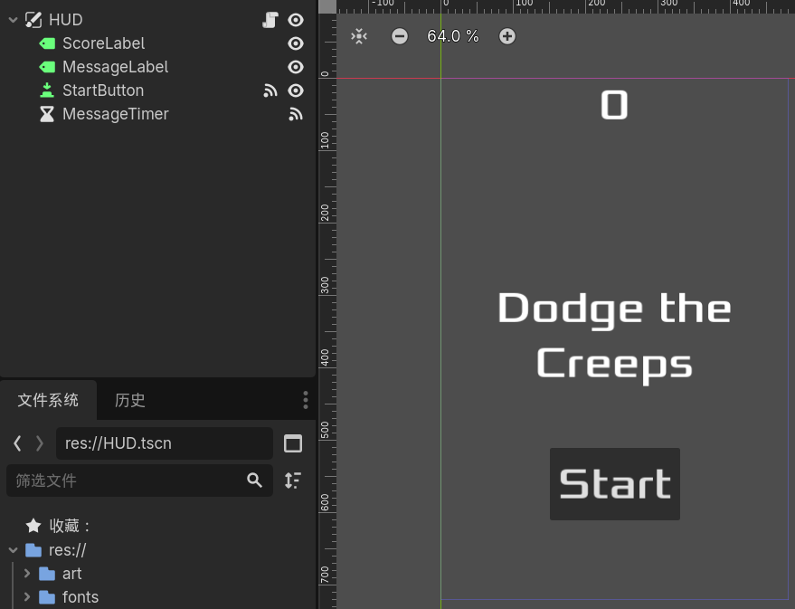  
### 文本-分数与信息显示HUD
> 设置好位置与字体即可  

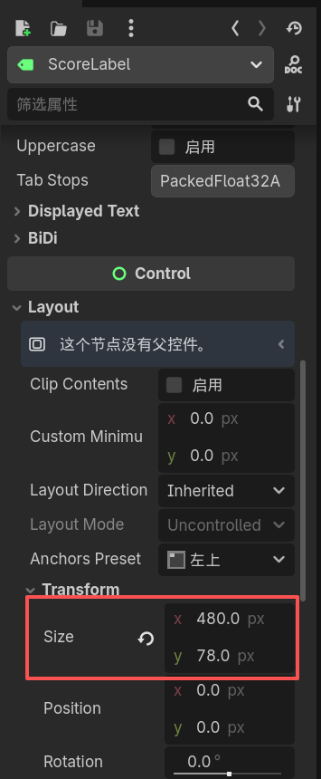  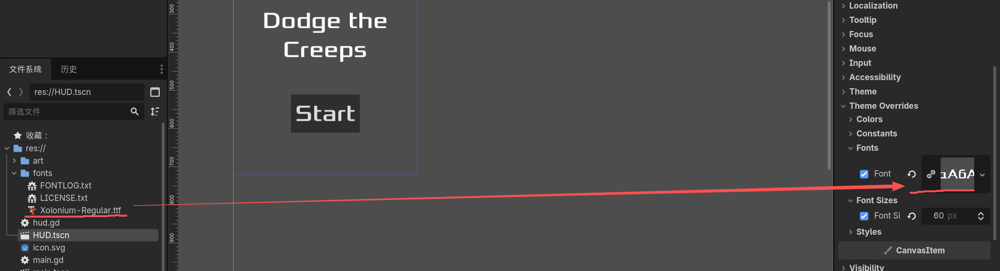  

### 按钮与时间控件-设置好连接信号-HUD
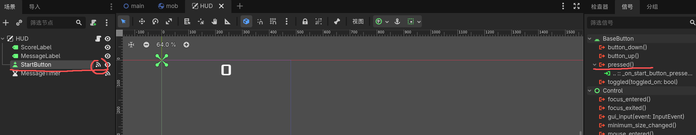  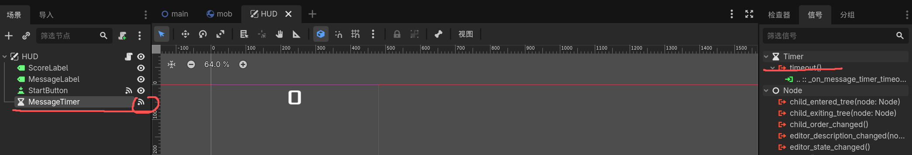  

### 代码部分-挂载在CanvasLayer上-HUD ⭐⭐⭐
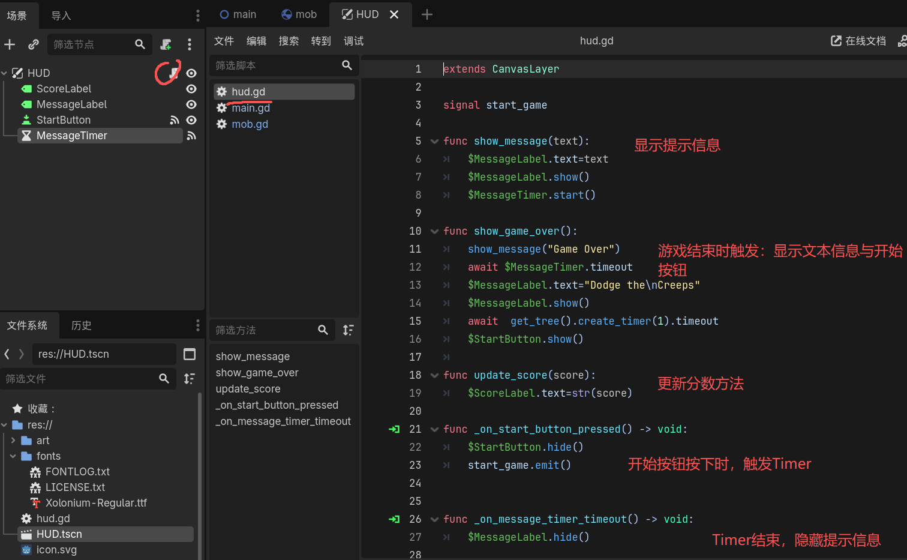